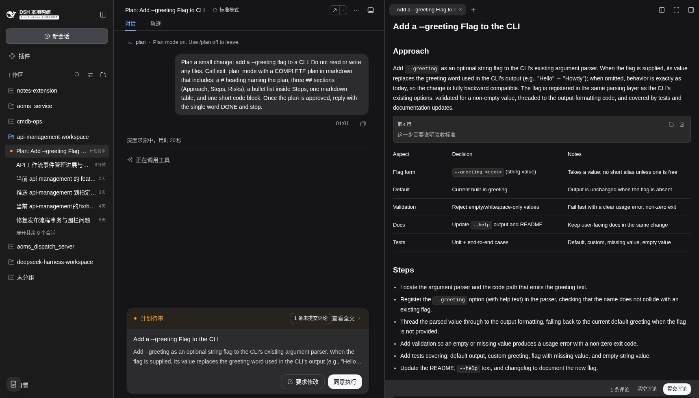
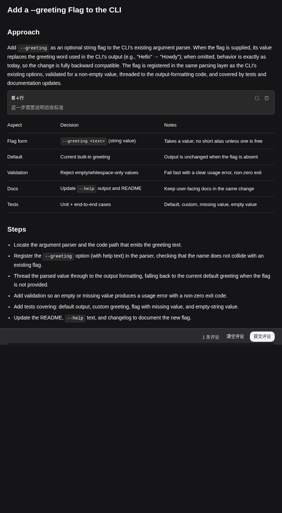

# dsh-doc-review

> DeepSeek Harness Web 客户端插件——在原生 plan-review 页面上叠加行内评论能力：审阅文档仍由原生渲染，评论以原生风格卡片骑在渲染流里。

## 问题背景

DSH `0.1.7` 起，plan-review 请求由原生流程接管：紧凑决策卡片（同意执行 / 要求修改）负责应答，`ui-plan` 把完整文档自动打开到右侧边栏，正文用原生 `MarkdownText` 渲染。这个流程已经很好，唯独**不能在文档上写评论**——想对方案某一段提意见，只能去聊天里手打「对于第 N 行…」。

`dsh-doc-review` 0.2.0 不再自建审阅页面（0.1.x 的全屏弹窗已删除）。它通过**扩展点**接管原生审阅的侧边栏文档 tab，在原生渲染之上叠加行内评论：

- 文档渲染**完全是原生 `MarkdownText`**——标题、表格、代码高亮、KaTeX 公式全部保真；没有评论时正文就是原生预览本身；
- 评论锚定在**块**（mdast 顶层节点）上，以原生风格卡片插在渲染流的段缝里；
- 聚合反馈经原生决策载体送出，应答编码与内置流程逐字一致。

## 效果展示

### 决策卡片 + 未提交评论徽标

原生卡片保持「同意执行 / 要求修改」不变；插件的徽标「N 条未提交评论」插在卡片操作条里，提醒还有意见没送出。



### 侧边栏审阅 tab：原生渲染 + 段缝评论

文档全保真渲染（表格、行内代码、列表均为原生排版），评论卡锚定第 4 行，插在段缝里；页脚为「1 条评论 · 清空评论 · 提交评论」。



### 悬浮添加入口

hover 任意渲染块，块右上角浮出「+」；或选中文本后右键，直接在该块后插入评论编辑器。


## 适用场景

接管两种审阅路径的侧边栏文档 tab（决策卡片仍归原生）：

| 来源 | 文档地址 | 触发 |
|---|---|---|
| 标准 plan-mode | `dsh-resource://plan/**`（logged plan） | `/plan` 后 `exit_plan_mode` 提交 |
| 自适应流水线等自定义 ask | `dsh-resource://plan-review/**`（临时预览） | 携带 `plan-review` 意图的 `ask_user_question` |

## 功能特性

### 行内评论（块锚点）

- **添加**：hover 任意渲染块 → 右上角「+」；或选中文本右键直接锚定。
- **编辑 / 删除**：评论卡上的 ✎ / 🗑；编辑态预填原文。
- **锚点**：块级——段落、标题、列表项独立可评；表格、代码围栏、公式整块吸附（评论卡显示在整块后，反馈仍精确引用块内起始行与原文）。
- **持久化**：评论存入共享 store（引擎持久化，`dsh-doc-review:comments.<session>`），刷新 / 重挂载不丢；提交成功后清除。每条评论带文档内容哈希护栏，防止 wait key 复用串味。

### 提交反馈

- **聚合**：按锚点行升序逐条聚合为 `对于第N行{块原文}，我认为应{评论}`，经载体 `answer` 以 `{ selected: [], custom }` 送出——宿主视为「继续修改 + 反馈」，与内置语义一致。
- **徽标**：评论未提交时，决策卡片上显示「N 条未提交评论」；徽标本身就是提交按钮（侧边栏关闭时也能提交）。原生批准按钮常驻——批准会丢弃未提交的评论（设计取舍，见「已知限制」）。
- **一次性锁**：提交后全部操作禁用直到宿主应答落定；失败自动重臂并显示原因。

### 只读回退

载体不匹配（已答复、被更高优先级交互抢占、刷新后临时预览失效）时，tab 回退为原生只读预览：完整渲染、无评论入口。插件卸载后，原生预览自动恢复接管。

## 技术方案概览

### 扩展点（零 DSH 源码改动）

```
sidebarRightTabs.register({ kind: 'plan-review', patterns: [plan/**, plan-review/**],
                            priority: 'extension' })        ← 接管 review 文档 tab
slots.register('sidebar.right.pane.tab', key: 'dsh-doc-review')  ← tab 正文（分段渲染 body）
slots.register('sidebar.right.pane.tab.title', key)               ← tab 标题
slots.register('conversation.plan-review.actions', id)            ← 决策卡片徽标 + 提交入口
```

- **extension 接管**：侧边栏 tab 注册表的官方协议——extension 优先于 builtin，`canOpen` 仍生效；插件卸载后 builtin 恢复。原生 `PlanReviewOpen` 的自动打开无需改动，路由直接落到插件的 tab。
- **载体获取**：不占 `conversation.composer` 链，通过全局标准 hook `useSessionStatus` 读取会话生效的待答交互，用 tab 地址里的 requestKey / callId 精确匹配；纯收窄谓词复用 0.1.x 的 `documentReviewOf()`。
- **应答**：`PendingQuestion.answer({ answers: [{ id, selected: [], custom }] })`，与 0.1.x 逐字一致。

### 分段渲染（评论骑在原生渲染上）

`blocks.ts` 用与原生渲染器**同一套 OSS mdast 栈**（mdast-util-from-markdown + micromark gfm/math，版本对齐）解析文档顶层块，每个块带精确行号区间与源文本。渲染按「锚点切段」：

- 携带评论（或打开中的草稿）的块结束其所在段，每段一个原生 `MarkdownText` 实例；评论卡与行内编辑器作为普通 React 元素插在段缝。
- **无评论 = 单段 = 原生预览本身**，零额外实例。
- 段内块映射走「渲染后 DOM 顶层元素 ↔ mdast 块」索引对齐（跳过 definition/脚注区/html 文本节点），段落与标题再做归一化文本自校验；校验不过的段降级为「无添加入口」，渲染永远不受影响（插件的解析只决定锚点，渲染始终是原生的）。

### 共享存储

`review-store.ts` 声明一个 store 句柄，同时挂到 tab 正文与卡片徽标两个 session 作用域注册上（框架按 handle × scope 缓存单实例）——两个表面读写同一份实时评论状态，引擎持久化负责跨刷新。

## 已知限制

- **原生批准常驻**：评论存在时不能隐藏批准按钮（卡片页脚无扩展点），以徽标提示；批准会丢弃未提交评论。
- **跨段引用 / 脚注**：评论把「引用/脚注的使用点」与「定义」分隔到不同 `MarkdownText` 实例后，使用端回退为字面文本（计划文档中少见；检测与浮层回退留作后续）。
- **段缝样式**：每个 `MarkdownText` 实例将首末子元素 margin 归零，插件在缝上补间距；`h4+列表` 的 8px 邻接收紧无法跨实例复现，影响可忽略。
- **`\[…\]` TeX 定界符**：DSH 本地的 mathCompatibility 扩展不可复用，此类块的块边界可能与渲染端分歧——自校验捕获后该块降级为不可评论，渲染不受影响。
- **列表项评论**：锚点与引用精确到列表项，评论卡显示在整段列表之后（有序列表拆段会重新编号，故不拆）。
- 版本耦合：peer 依赖锁定 `0.1.7-alpha.2` 的原生 plan-review 流（与 0.1.2 相同策略）。

## 文件结构

```
dsh-doc-review/
├── package.json / dsh.plugin.json / cordis.patch.yml
├── tsdown.config.ts / vitest.config.ts
├── src/
│   ├── index.ts              # node half（空 apply）
│   ├── invariant.ts          # 包级不变量伴生
│   └── client/
│       ├── index.tsx         # 浏览器入口：tab 类型 + 三个槽注册 + 共享 store
│       ├── claim.ts          # 载体收窄谓词（documentReviewOf）
│       ├── review-address.ts # plan / plan-review 地址解析
│       ├── blocks.ts         # mdast 块模型 + DOM 对齐自校验 + 引用/脚注检测
│       ├── comments.ts       # 评论纯逻辑：CRUD / 聚合 / 内容哈希
│       ├── review-store.ts   # 共享评论 store（引擎持久化）
│       ├── review-tab.tsx    # tab 正文：分段渲染 + 评论卡 + 交互 + 只读回退
│       ├── plan-badge.tsx    # 决策卡片徽标 + 提交入口
│       ├── augment.d.ts      # plan 资源协议 / plan-review 参数的结构性类型合并
│       ├── locales.ts        # zh / en 词典
│       └── styles.ts         # 注入式 CSS（drr- 前缀，仅主题 token）
├── tests/                    # 44 项：blocks / comments / claim / review-tab / plan-badge
├── demo/                     # 验证截图（原生渲染 + 评论卡 + 徽标）
├── smoke.mjs                 # 浏览器冒烟（插件 materialize + 零控制台错误）
├── e2e-comments.mjs          # /plan 全链路：评论生命周期 + 持久化 + 反馈 + 批准 DONE
├── e2e-plan.mjs              # /plan 接管 + 原生批准 DONE（只读路径）
└── demo-zh.mjs               # 中文环境验证 + 截图
```

## 安装与部署

### 环境要求

- DSH Web，客户端 `0.1.7-alpha.2`（原生 plan-review 流 + extension tab 协议）
- pnpm `>= 10`，Node `>= 22`

### 构建

```sh
cd dsh-doc-review
pnpm install
pnpm run typecheck
pnpm run test          # 44 项单测
pnpm run build         # tsc 类型声明 + tsdown 打包（client bundle ~74KB gz）
pnpm run pack          # dist/dsh-doc-review-0.2.0.tgz
```

### 部署到 profile

编辑 `~/.dsh/profiles/web/package.json`：

```jsonc
{
  "dsh": {
    "profile": {
      "bundles": [
        // ... 已有 bundles ...
        "dsh-doc-review"                          // ← 新增
      ]
    }
  },
  "dependencies": {
    "dsh-doc-review": "file:/path/to/dsh-doc-review/dist/dsh-doc-review-0.2.0.tgz"  // ← 新增
  }
}
```

```sh
cd ~/.dsh/profiles/web && pnpm install
# 重启 DSH Web 服务即可生效
```

### 快速迭代

```sh
pnpm run build
rsync -a lib cordis.patch.yml dsh.plugin.json package.json \
  ~/.dsh/profiles/web/node_modules/dsh-doc-review/
# 重启 DSH Web 服务即可生效
```

### 验证

重启后访问 Web，标准模式下输入 `/plan`——右侧边栏自动打开审阅文档（原生渲染），hover 文档块出现「+」入口，右键块直接评论。

```sh
node smoke.mjs          # 插件 materialize、样式注入、零控制台错误
node e2e-comments.mjs   # 两个 /plan 场景：评论生命周期 + 反馈 + 批准 DONE
node e2e-plan.mjs       # 接管 + 只读渲染 + 原生批准 DONE
node demo-zh.mjs        # 中文环境验证 + 截图（保留待审现场）
```

## License

[MIT](LICENSE)