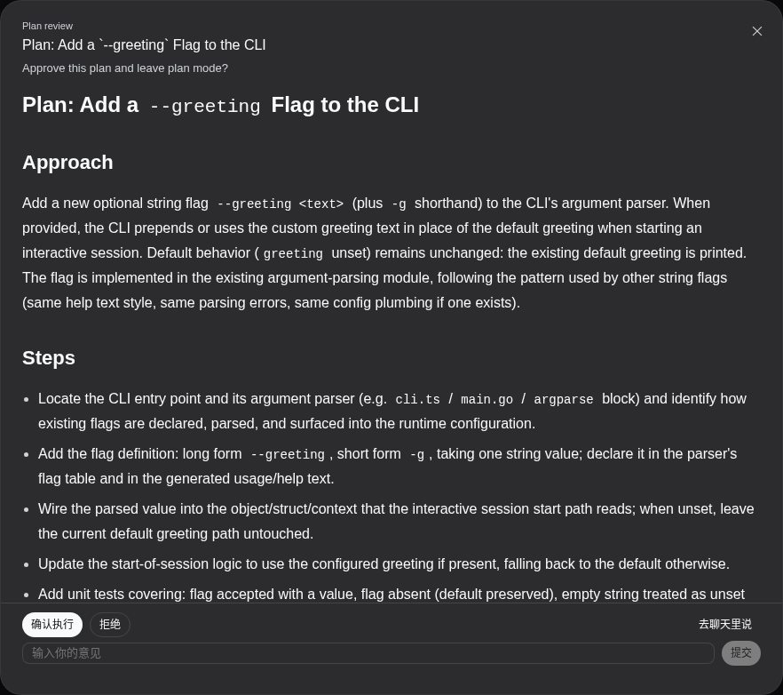
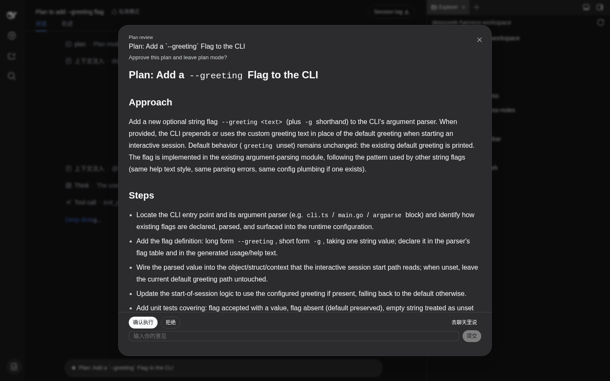

# dsh-doc-review

> DeepSeek Harness Web 客户端插件——将设计文档与方案审阅从紧凑卡片升级为全幅渲染 Markdown 弹窗。

## 问题背景

DeepSeek Harness Web 内置的问题编辑器（`QuestionComposer`）为通用提问设计：标题、选项列表、自定义输入框，整体是一张紧凑卡片。这种布局适合「选择方案 A 还是 B」这类简短问题。

但当内容是**完整的 Markdown 设计文档**——包含标题层级、模块划分表格、接口定义代码块、风险列表——时，卡片内 60vh / 520px 的滚动区域显得局促，标题、表格和代码块混在狭窄的卡片体里，审阅体验不佳。

`dsh-doc-review` 插件将文档形态的提问替换为一个**全屏弹窗**，以渲染后的 Markdown 全幅展示设计文档，同时保留完整的交互能力（选项选择、自定义意见、取消）。

## 效果展示

### 弹窗主视图（中文环境）

文档以全宽渲染，标题、列表、表格、代码块完整呈现。弹窗页脚两行：选项按钮一行（左）+ 取消（右），输入框一行。



### 整页视图

弹窗覆盖整个浏览器视口，文档正文区域可滚动，标题栏和操作栏固定不动。



### 收起控制条

关闭弹窗（X / Esc）后，编辑器区保留一条紧凑的控制条——文档标题 + 「展开完整文档」按钮 + 选项按钮 + 取消。**关闭弹窗不等于取消请求**，随时可以重新展开。


## 适用场景

本插件接管以下两种文档审阅路径：

| 来源 | 触发方式 | 路径 |
|---|---|---|

| 标准 plan-mode | `/plan` 后 `exit_plan_mode` 提交方案审阅 | 宿主 `dsh-plan-mode` → `userQuestions.ask` |

两者提交到客户端的问题形态相同（`plan-review` 意图 + 文档 Markdown detail + ≤ 2 个选项），本插件统一接管。

未被认领的提问（短问题、无标题 detail、多选、>3 选项、未知意图等）原样落回内置问题编辑器，行为零变化。

## 功能特性

### 文档渲染

- GFM Markdown 全量渲染：标题层级、列表、表格、代码块（含语法高亮）、KaTeX 数学公式、脚注。
- 宽表格在弹窗内横向滚动（聊天流的容器查询突围仅作用于消息列）。

### 交互能力

- **选项按钮**：单选即提交，与内置流程答案编码一致（原样携带提问方标签）。
- **自定义意见**：单行输入框 + 提交按钮，用于补充修改意见。
- **去聊天里说**：以 `ASK_CANCELLED` 拒绝请求，编辑器恢复为普通聊天状态。
- **一次性锁**：点击后禁用所有操作，直到宿主响应落定；失败自动重臂并显示错误。

### 弹窗行为

- **自动弹出**：文档类提问到达时弹窗立即打开，无需手动触发。
- **关闭不取消**：X / Esc / 点击遮罩层关闭弹窗，请求保持待审状态。
- **重新展开**：控制条上的「展开完整文档」按钮重新打开弹窗。
- **重连恢复**：页面刷新或断连重连后，待审弹窗随组件重开。

### 国际化

- 插件自身文案（标题 / 展开 / 关闭 / 取消 / 提交等）双语（zh / en），注册于 `doc-review` locale 命名空间，随界面语言自动切换。
- plan-review 意图的英文选项标签（宿主 `dsh-plan-mode` 写死的 `Approve` / `Keep planning`）按意图语义显示本地化按钮文案（确认执行 / 拒绝），tooltip 保留提问方描述，**发送的答案值始终是原标签**。
- 中文标签（自适应流水线的「确认定稿」）原样显示，不做替换。

## 技术方案概览

### 架构

`dsh-doc-review` 是一个纯浏览器端的 Cordis 客户端插件，宿主侧（node half）为空——仅需一个空 `apply()` 使 Loader 能挂载行，浏览器半通过 `dsh.client` 声明由 Web 模块表动态加载。

```
conversation.composer chain
  priority -1  ← dsh-doc-review（文档提问：弹窗接管）
  priority  0  ← dsh-client-ui-user-questions（通用提问：卡片流程）
  priority  1  ← dsh-client-ui-conversation（审批流程）
```

插件以 `priority: -1` 注册进 `conversation.composer` 键控链式 slot。Chain 按优先级升序运行 selector，首个非空即胜出——文档类提问被本插件认领后，内置问题编辑器的 selector 不再执行；其余提问原样落回。

### 认领条件

`claim.ts` 中的纯函数 `documentReviewOf()` 是认领谓词，chain selector 与组件共用。满足以下全部条件才接管：

1. 单个 question（非多题批量）；
2. `multiSelect` 非真；
3. `intent` 为 `undefined` 或 `{ kind: 'plan-review' }`；
4. `detail` 为含 Markdown ATX 标题行（`/^#{1,6}\s+\S/m`）的字符串；
5. 选项数 ≤ 3。

### 组件结构

```
DocReviewPanel
├── dr-frame（根容器）
│   ├── dr-bar（控制条，始终挂载）
│   │   ├── dr-bar-head（圆点 + 标题 + 展开按钮）
│   │   └── dr-bar-body（弹窗关闭时：选项 + 取消）
│   └── Modal headless（弹窗，expanded 时打开）
│       ├── dr-modal-head（kicker + 标题 + 关闭按钮）
│       ├── dr-modal-question（问题文本）
│       ├── dr-modal-body（MarkdownText 渲染，可滚动）
│       └── dr-modal-footer
│           ├── dr-actions-row（选项按钮 + 取消）
│           └── dr-custom（输入框 + 提交）
```

弹窗使用 `Modal` 原语的 `headless` 模式——自建 header / body / footer 骨架，使标题栏和操作栏固定、文档正文独立滚动。内置 `Modal` 默认模式的 header 会随内容一起滚动，不适合文档审阅场景。

### 答案编码

逐字复用内置问题编辑器的应答语义：

| 操作 | 应答 |
|---|---|
| 点击选项按钮 | `{ answers: [{ id, selected: [label] }] }` |
| 自定义意见 + 提交 | `{ answers: [{ id, selected: [], custom: text }] }` |
| 去聊天里说（取消） | `{ ok: false, error: { code: 'cancelled', ... } }` |

`label` 始终是提问方提供的原始标签（`Approve` / `确认定稿` 等），即使按钮显示的是本地化文案。

### 构建产物

`tsdown.config.ts` 产出三个目标：

| 产物 | 格式 | 用途 |
|---|---|---|
| `lib/index.js` + `lib/invariant.js` | ESM | Loader node half |
| `lib/client.js` | CJS bundle + `__ModuleLoader__` banner | 模块表动态行（row id: `dsh-doc-review`） |
| `lib/client-registry.js` | 同上（id: `dsh-external/dsh-doc-review`） | 插件发现清单 |

浏览器端外部化 `react`、`react/jsx-runtime`、`@deepseek-ai/dsh-client-ui-primitives`——通过模块表 `require()` 在运行时解析；其余 `@deepseek-ai/*` 类型导入在构建时擦除，不产生模块请求。

### 文件结构

```
dsh-doc-review/
├── package.json              # 插件清单（dsh.client manifest + bundle patch）
├── cordis.patch.yml          # Loader 行声明
├── dsh.plugin.json           # 插件发现元数据
├── tsconfig.json / .build.json
├── tsdown.config.ts          # tsdown 打包配置（node ESM + 两个 client CJS）
├── vitest.config.ts          # 测试配置（resolve.alias → DSH 源码）
├── src/
│   ├── index.ts              # node half（空 apply）
│   ├── invariant.ts          # 包级不变量伴生
│   └── client/
│       ├── index.tsx          # 浏览器入口：注册词典 + 样式 + chain 条目
│       ├── claim.ts           # 认领谓词 + 类型定义
│       ├── DocReviewPanel.tsx # 主组件（弹窗 + 控制条 + DecisionRow）
│       ├── locales.ts         # zh / en 词典
│       └── styles.ts          # 注入式 CSS（dr- 前缀，仅用主题 token）
├── tests/
│   ├── claim.client.spec.ts           # 认领矩阵（18 项）
│   └── doc-review-panel.client.spec.tsx # 面板行为（12 项，含 i18n）
├── demo/                             # 验证截图
│   ├── modal-open-zh.png             # 弹窗主视图
│   ├── modal-fullpage-zh.png         # 整页视图
│   └── bar-collapsed-zh.png          # 收起控制条
├── smoke.mjs                    # 浏览器冒烟验证
├── e2e-plan.mjs                 # 标准 plan-mode 端到端验证
└── demo-zh.mjs                  # 中文环境验证 + 截图
```

## 安装与部署

### 环境要求

- DeepSeek Harness `>= 0.0.1`
- pnpm `>= 11`
- Node `>= 22`

### 构建

```sh
cd dsh-doc-review

# 首次安装依赖（需要能访问 DSH 仓库的 node_modules）
# node_modules/@deepseek-ai → 指向 deepseek-harness/apps/cli/node_modules/@deepseek-ai
pnpm install

pnpm run typecheck    # 类型检查
pnpm run test         # 单元测试（30 项全绿）
pnpm run build        # 构建（tsc 类型声明 + tsdown 打包）
pnpm run pack         # 打包 tarball → dist/dsh-doc-review-0.1.0.tgz
```

### 部署到 profile

编辑 `~/.dsh/profiles/web/package.json`：

```jsonc
{
  "dsh": {
    "profile": {
      "bundles": [
        // ... 已有 bundles ...
        "dsh-doc-review"                          // ← 新增
      ]
    }
  },
  "dependencies": {
    // ... 已有依赖 ...
    "dsh-doc-review": "file:/path/to/dsh-doc-review/dist/dsh-doc-review-0.1.0.tgz"  // ← 新增
  }
}
```

然后：

```sh
cd ~/.dsh/profiles/web
pnpm install

# 重启 DSH Web 服务
pkill -f "node --import tsx/esm apps/cli/src/bin.ts web"
cd /path/to/deepseek-harness
node --import tsx/esm apps/cli/src/bin.ts web &
```

### 快速迭代

开发期间可跳过打包步骤，直接同步构建产物：

```sh
pnpm run build
rsync -a lib/ cordis.patch.yml dsh.plugin.json \
  ~/.dsh/profiles/web/node_modules/dsh-doc-review/

# 重启 DSH Web 服务即可生效
```

### 验证

重启后访问 `http://127.0.0.1:3080/`，在自适应模式下跑一个任务进入设计阶段，或在标准模式下输入 `/plan`——弹窗应自动弹出并渲染设计文档。

项目内置了三个验证脚本：

```sh
# 浏览器冒烟（插件加载、样式注入、零错误）
node smoke.mjs

# 标准 plan-mode 端到端（弹窗接管 + 弹窗内批准 + DONE）
node e2e-plan.mjs

# 中文环境验证（按钮全部中文、紧凑布局、截图）
node demo-zh.mjs
```

## 已知限制

- 弹窗内宽表格保持横向滚动——`md-table-wide` 的容器查询突围仅作用于聊天消息流，弹窗是通用表面。
- 弹窗不锁焦点（与 DSH 内置 `Modal` 一致）。
- 重连 / 重挂载后弹窗随组件重开，与「新的待审请求」语义一致。
- 答案值始终是提问方原始标签（中 / 英文），按钮显示语言随界面切换。

## License

[MIT](LICENSE)

```
MIT License

Copyright (c) 2026 yaodongH

Permission is hereby granted, free of charge, to any person obtaining a copy
of this software and associated documentation files (the "Software"), to deal
in the Software without restriction, including without limitation the rights
to use, copy, modify, merge, publish, distribute, sublicense, and/or sell
copies of the Software, and to permit persons to whom the Software is
furnished to do so, subject to the following conditions:

The above copyright notice and this permission notice shall be included in all
copies or substantial portions of the Software.

THE SOFTWARE IS PROVIDED "AS IS", WITHOUT WARRANTY OF ANY KIND, EXPRESS OR
IMPLIED, INCLUDING BUT NOT LIMITED TO THE WARRANTIES OF MERCHANTABILITY,
FITNESS FOR A PARTICULAR PURPOSE AND NONINFRINGEMENT. IN NO EVENT SHALL THE
AUTHORS OR COPYRIGHT HOLDERS BE LIABLE FOR ANY CLAIM, DAMAGES OR OTHER
LIABILITY, WHETHER IN AN ACTION OF CONTRACT, TORT OR OTHERWISE, ARISING FROM,
OUT OF OR IN CONNECTION WITH THE SOFTWARE OR THE USE OR OTHER DEALINGS IN THE
SOFTWARE.
```
